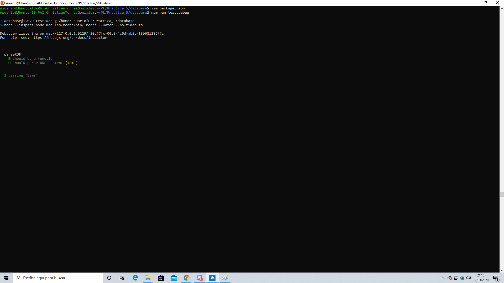

#  Práctica: Transforming Data and Testing Continuously

El objetivo de esta practica será aprender a utilizar Node.js para transformar datos XML a JSON Y LDJ(line-delimited). Para ello nos ayudaremos del capitulo 5 del libro "Transforming Data and Testing Continuously"

# Creando la estructura de directorios

En primer lugar deberemos de crear nuestra estructura de directorios que utilizaremos para trabajar.
Dicha estructura consta de dos directorios principalmente:
	- data: almacenaremos datos de libros en formato rdf
		- mkdir data
	- database: almacenaremos el codigo fuente.
		- mkdir database

A continuacion procedemos a descargar los archivos rdf de los libros
	- curl -O *http://www.gutenberg.org/cache/epub/feeds/rdf-files.tar.bz2
	- tar -xvjf rdf-files.tar.bz2

# Behavior-Driven Development with Mocha and Chai
## Creando package.json

Idealmente, nos gustaría tener toda esta información formateada como un documento JSON adecuado para pasar a una base de datos de documentos. Para la implementan de nuestro archivo JSON, tendremos que analizar el archivo RDF.
	-	Partiremos del package.json que se nos crea cuando ejecutamos: npm init -y

Para continuar, deberemos instalar dos paquetes, Mocha y Chai
	- ​​npm install --save-dev --save-exact mocha@2.4.5 chai@3.5.0
Tras realizar la instalación, deberemos modificar nuestro package.json para indicar que también queremos trabajar con el script de **mocha**

### Directorio TEST y LIB
A continuación, deberemos crear el directorio **test**, que es el directorio con el que trabaja Mocha por defecto, ya que es ahi donde guardaremos el archivo .js correspondiente
	- mkdir test
	- npm test

El problema que tenemos es que no tenemos un expect por el cual estamos preguntando. Para ello crearemos el archivo **parse-rdf-test.js**, en el que introduciremos el siguiente código:

Ademas tenemos que crear el archivo **parse-rdf.js**, donde introduciremos:

Si a continuacion volvemos a ejecutar npm test, obtenemos la siguiente salida:

A continuacion, deberemos permetir el testeo continuo con **Mocha**

# Extracting Data from XML with Cheerio
En primer lugar instalamos **Cheerio** con
	- npm install --save --save-exact cheerio@0.22.0

Tras realizar la instalación ejecutaremos los test de manera continua con Mocha como ya hemos visto anteriormente

A continuacion modificamos los archivos para que en la prueba también seamos capaces de leer el id del libro

# Debugging Tests with Chrome DevTools

Para poder debugear utilizando la herramiento de chrome, en primer lugar tendremos que modificar nuestro fichero package.json añadiendo la linea:
	- "test:debug": "node --inspect node_modules/mocha/bin/_mocha --watch --no-timeouts"

A continuacion ejecutamos npm run test:debug

